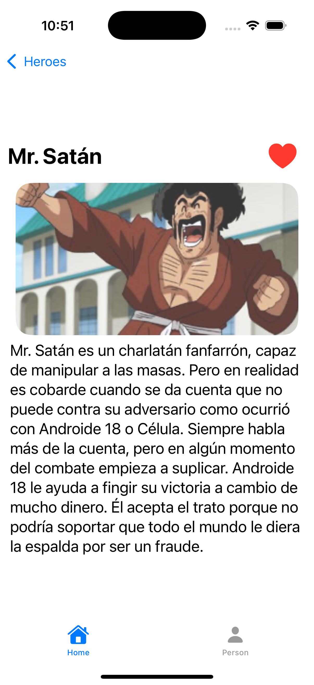
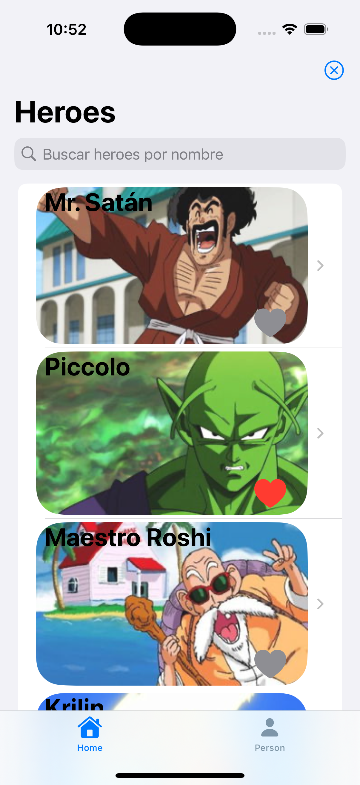

# Dragon Ball API App

**Dragon Ball API** application built with **Swift** and **SwiftUI**.  
It showcases how to perform API calls, handle asynchronous data streams, and integrate **TipKit** for in-app guidance.  
Additionally, it leverages Swift’s new `@Observable` macro to efficiently track state changes and update the UI reactively.

## Preview

  
  

  
  

  
  

