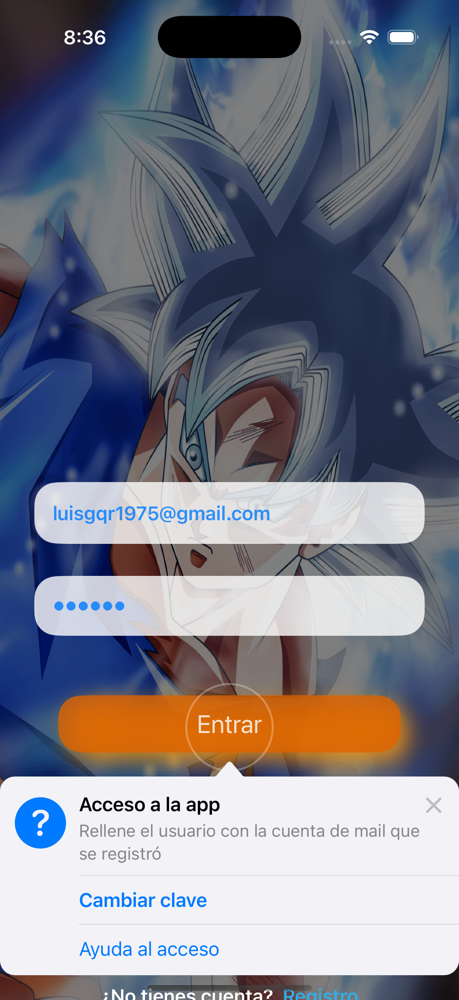
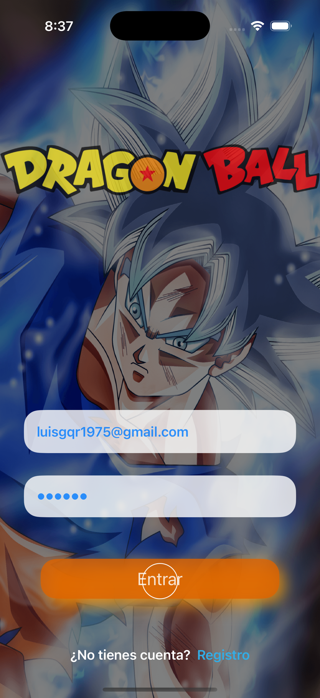
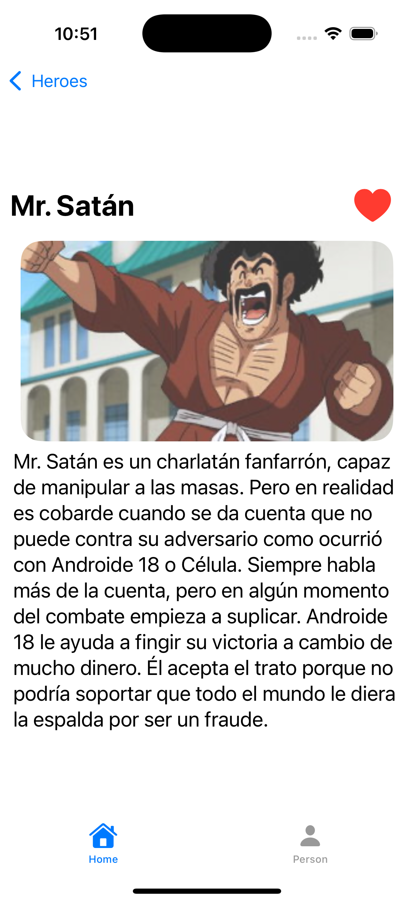
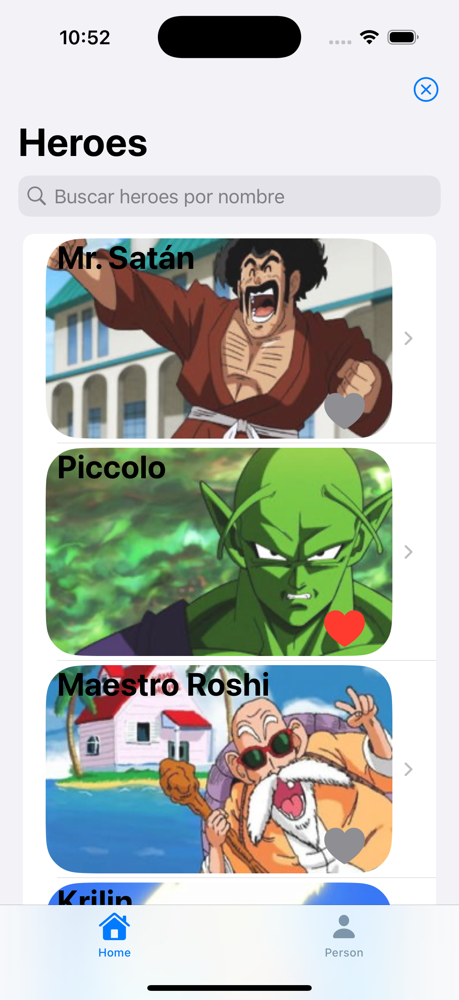

# HerosDragonBallSwiftUI

Dragon Ball API application built with Swift and SwiftUI.

## Features
- Browse Dragon Ball characters from a REST API
- Asynchronous data handling with Combine and async/await
- Reactive UI using Swift's `@Observable` macro
- In-app contextual guidance with TipKit
- Unit and UI tests with XCTest

## Tech Stack
| Layer | Technology |
|---|---|
| UI | SwiftUI |
| State | @Observable |
| Networking | URLSession + async/await |
| Reactive | Combine |
| Guidance | TipKit |
| Testing | XCTest |

## Architecture
MVVM — clear separation between data, business logic, and UI layers.

## Requirements
- iOS 17+
- Xcode 15+

## How to Run
1. Clone the repo
2. Open `HerosDragonBallSwiftUI.xcodeproj` in Xcode
3. Run on simulator or device (iOS 17+)
4. To run tests: `Cmd + U`

## Preview

  
  

  
  

  
  

